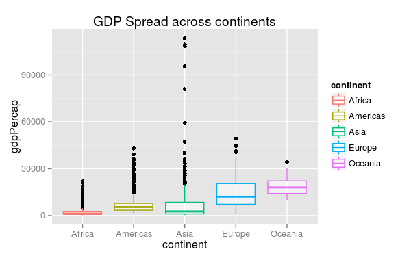
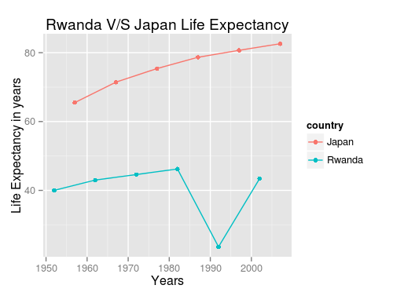

# 2_coding_sample
namanpaul  
August 23, 2017  
####This is a coding sample based on gapminder dataset, representative of my coding style. It was one of the many assignments for the STAT 545 course at UBC. Highlights the flow of code, reporting and visualization strategies, and interpretation of the results

---


####Exploring the dplyr package

---

***Loading the packages***


```r
library(reshape2)
library(gapminder)
suppressMessages(library(plyr))
suppressMessages(library(dplyr))
library(ggplot2)
library(knitr)
```


***Task 1 : Get the maximum GDP per capita for all continents***

I used the piping here, inorder to retrieve data for the continents. 
The expression also groups the *gap_df* data by *continent*, summarizing the minimum and maximum GDP Per capita.


```r
gap_df <- tbl_df(gapminder)

#my piping attempt
#gap_df %>% glimpse
#min_max_GDP_cont would store the subset comparing continents with max and min GDP
min_max_GDP_cont <- gap_df %>% 
  group_by(continent) %>% 
  summarise(max_GDP = max(gdpPercap), min_GDP = min(gdpPercap))

#using kable to display the
min_max_GDP_cont %>% kable(format = 'markdown',digits=2)
```


---
|continent |   max_GDP|  min_GDP|
|:---------|---------:|--------:|
|Africa    |  21951.21|   241.17|
|Americas  |  42951.65|  1201.64|
|Asia      | 113523.13|   331.00|
|Europe    |  49357.19|   973.53|
|Oceania   |  34435.37| 10039.60|
---
```r
#visualizing the output using a ggplot
(ggplot(min_max_GDP_cont) + 
  geom_linerange(aes(x=continent, ymin=min_GDP, ymax=max_GDP, width = 1.0, color=continent)) + 
  xlab("Continents") + 
  ylab("GDP Per Capita")) + 
  ggtitle("GDP Per Capita across Continents")
  
#very basic ggplot features used  
```

---


---


***Task 2: GDP spread among the continents***

To analyze the spread of the GDP among the different continents, I used the following:

- minimum GDP
- maximum GDP
- mean of GDP
- median of GDP
- standard deviation of GDP


```r
#Making the beautiful kable-table
#from gap_df we extract information about the min,max, compute mean,median, sd and group it by continents

gap_df %>% 
  group_by(continent) %>% 
  summarise(gdpPercap_min = min(gdpPercap),
            gdpPercap_max = max(gdpPercap),
            gdpPercap_mean = mean(gdpPercap),
            gdpPercap_median = median(gdpPercap),
            gdpPercap_sd = sd(gdpPercap)) %>% 
  kable(format='markdown',digits=2)
```


|continent | gdpPercap_min| gdpPercap_max| gdpPercap_mean| gdpPercap_median| gdpPercap_sd|
|:---------|-------------:|-------------:|--------------:|----------------:|------------:|
|Africa    |        241.17|      21951.21|        2193.75|          1192.14|      2827.93|
|Americas  |       1201.64|      42951.65|        7136.11|          5465.51|      6396.76|
|Asia      |        331.00|     113523.13|        7902.15|          2646.79|     14045.37|
|Europe    |        973.53|      49357.19|       14469.48|         12081.75|      9355.21|
|Oceania   |      10039.60|      34435.37|       18621.61|         17983.30|      6358.98|
--- 

Visualizing the data with a ggplot
```r
#Plotting this spread
(ggplot(gap_df) + 
  aes(x=continent, y=gdpPercap, color=continent) + 
  geom_boxplot(alpha=0.5) + 
  ggtitle("GDP Spread across continents"))
```


Clearly, Africa ranks the lowest among the continets in terms of the GDPPercap.

---

Now, Visualizing the spread using a density plot (ggplot)


```r
#just use this one
(ggplot(gap_df) + aes(x=log10(gdpPercap), fill=continent) +
  geom_density(alpha=0.5) + 
  xlab("log measure of GDP Per Capita") + 
  ylab("Density") + 
  ggtitle("GDP Per capita Density Plot"))
```
---


---

The Oceania continent comprises of 25 countries, of which most are island countries: lower population higher GDP percapita in contrast to the African contient.

---

This shows the spread, needs further exploration.

---


***Task 3: Vanilla task (a simpler task)***

It was unclear to me, at the first place, what *Vanilla Mean* meant. 

Was enlightened by this particular [article.](http://www.mymarketresearchmethods.com/descriptive-inferential-statistics-difference/)

So for this task I looked at the lifeExpectancy measure, how this differs
when weighted according to the geographic location, and gdpPercap!
---

```r
#trimmed mean
mean_trimmed <- gap_df %>% 
  group_by(year) %>% 
  select(year,lifeExp,continent,gdpPercap) %>% 
  summarise(regular_mean= mean(lifeExp),
            trimmed_mean_lifeExp= mean(lifeExp, trim = 0.30),
            weighted_mean_lifeExp_cont= weighted.mean(lifeExp,continent),
            weighted_mean_lifeExp_gdpPercap= weighted.mean(lifeExp,gdpPercap))
            

mean_trimmed %>% kable(format='markdown',digits=2)
```
| year| regular_mean| trimmed_mean_lifeExp| weighted_mean_lifeExp_cont| weighted_mean_lifeExp_gdpPercap|
|----:|------------:|--------------------:|--------------------------:|-------------------------------:|
| 1952|        49.06|                46.83|                      53.49|                           57.50|
| 1957|        51.51|                49.86|                      55.99|                           59.98|
| 1962|        53.61|                52.40|                      58.04|                           62.05|
| 1967|        55.68|                55.15|                      60.03|                           63.93|
| 1972|        57.65|                57.88|                      61.85|                           65.79|
| 1977|        59.57|                60.42|                      63.63|                           67.47|
| 1982|        61.53|                62.82|                      65.48|                           69.48|
| 1987|        63.21|                65.01|                      67.04|                           71.46|
| 1992|        64.16|                66.50|                      68.15|                           72.86|
| 1997|        65.01|                67.69|                      69.25|                           74.05|
| 2002|        65.69|                68.91|                      70.24|                           75.05|
| 2007|        67.01|                70.27|                      71.47|                           75.97|


```r
#library(reshape2), here I first used the melt function, to keep things easy
#melt function:

data_melt <- melt(mean_trimmed, id="year")

#plot trimmed and weighted mean
ggplot(data=data_melt, 
       aes(x=year, y=value, color=variable)) +
       geom_line() +
       geom_point() +
       xlab("Year") +
       ylab("Life Expectancy in years") +
       ggtitle("Weighted and Trimmed Means variability")
```

---


---


This was pretty interesting, how the trimmed and weighted means would yield different meanings altogether. In this case, these were some of my inferences:

- The regular mean of *Life Expectancy*, which we could easily calculate, might not provide sufficient information, to end up with a conclusion.
- However, if we have weighted the mean with either the continent, or the GDP, we get very different results.
- It does depend on what continent we live, and how much not us, but everybody earns; that determines our life expectancy. INTERESTING!


---


***Task 4: How is life expectancy changing over time in continents?***

I used a weighted mean, to determine how the longitivity varies across continents, over time. 

I weighted the mean using:

- Population
- GDP Per capita


```r
#this piping function, would select the year, lifeExp, cont, population, gdp and summarize it according to the weighted mean grouping them by year and continent

cont_lifeExp <- gap_df %>% 
  group_by(year,continent) %>% 
  select(year, lifeExp,continent, pop, gdpPercap) %>% 
  summarise(w_mean= weighted.mean(lifeExp,continent,pop))


#plotting using ggplot, with lines and points to show changes across time
ggplot(cont_lifeExp, 
       aes(x=year, y=w_mean, color=continent)) +
       geom_line() +
       geom_point() +
       xlab("Years") +
       ylab("Weighted Mean Life Expectancy") +
       ggtitle("Life Expectancy variation over time across continents")
```
---


---


The following can be inferred:

- Europe, has been consistently a dwelling continent with higher longetivity. Nothing has changed, and its on a steady rise.
- Africa, was progressing well on the life expectancy front, but was slowed down by various factors after 1990s, a disturbing scenario. Reading [this](http://econsguide.blogspot.ca/2009/02/possible-reasons-for-uks-deficit-in-its.html) exposed the factors.

---


***Task 5: Relative abundance of countries with low life expectancy over time by continent***

Finding countries that have highest and lowest life expectancy in the world

```r
#Finding the countires with highest and lowest lifeExp
min_max_lifeExp <- gap_df %>% 
  group_by(year) %>% 
  select(year,lifeExp,country) %>% 
  summarise(min_lifeExp= min(lifeExp),
            max_lifeExp= max(lifeExp))

min_max_lifeExp %>% kable(format='markdown',digits=2)
```

---

| year| min_lifeExp| max_lifeExp|
|----:|-----------:|-----------:|
| 1952|       28.80|       72.67|
| 1957|       30.33|       73.47|
| 1962|       32.00|       73.68|
| 1967|       34.02|       74.16|
| 1972|       35.40|       74.72|
| 1977|       31.22|       76.11|
| 1982|       38.45|       77.11|
| 1987|       39.91|       78.67|
| 1992|       23.60|       79.36|
| 1997|       36.09|       80.69|
| 2002|       39.19|       82.00|
| 2007|       39.61|       82.60|
---

A steady rise...


```r
#melting them
min_max_lifeExp_melt <- melt(min_max_lifeExp, id="year")

#plotting them with ggplot
ggplot(min_max_lifeExp_melt, aes(x=year, y=value, color=variable))+
  geom_line()+
  geom_point() +
  xlab("Years") +
  ylab("Life Expectancy in years") +
  ggtitle("Difference between maximum and minimum Life Expectancy")
```
---


---
Incredible difference, between the minimum and maximum lifeExp values!

Let's further explore it

---


***Task 6: Interesting stories***

I have performed these 2 analyses:

1. Life Expectancy difference between max and min.
2. Life Expectancy in North American countries.


```r
#Viewing Rwanda, compared to Japan what happened to the lifeExp there
#found out using the subset below

maxm <- subset(gap_df, gap_df$lifeExp==max(gap_df$lifeExp))
maxm %>% glimpse()
```

Output for maximum:

Observations: 1
Variables: 6
$ country   (fctr) Japan
$ continent (fctr) Asia
$ year      (dbl) 2007
$ lifeExp   (dbl) 82.603
$ pop       (dbl) 127467972
$ gdpPercap (dbl) 31656.07

---

And similarly finding min life Exp

```r
minm <- subset(gap_df, gap_df$lifeExp==min(gap_df$lifeExp))
minm %>% glimpse()
```
---
Observations: 1
Variables: 6
$ country   (fctr) Rwanda
$ continent (fctr) Africa
$ year      (dbl) 1992
$ lifeExp   (dbl) 23.599
$ pop       (dbl) 7290203
$ gdpPercap (dbl) 737.0686
---

Let's compare Japan and Rwanda (countries with the max difference in their life expectancies over the years)
---
```r
#rw_jpn list created with the country names, which I want to subset
rw_jpn <- c('Rwanda','Japan')

#subset
rwanda_japan <- subset(gap_df, gap_df$country==rw_jpn)

#printing as a kable table
kable(rwanda_japan, format = 'markdown',digits=2)
```

---

|country |continent | year| lifeExp|       pop| gdpPercap|
|:-------|:---------|----:|-------:|---------:|---------:|
|Japan   |Asia      | 1957|   65.50|  91563009|   4317.69|
|Japan   |Asia      | 1967|   71.43| 100825279|   9847.79|
|Japan   |Asia      | 1977|   75.38| 113872473|  16610.38|
|Japan   |Asia      | 1987|   78.67| 122091325|  22375.94|
|Japan   |Asia      | 1997|   80.69| 125956499|  28816.58|
|Japan   |Asia      | 2007|   82.60| 127467972|  31656.07|
|Rwanda  |Africa    | 1952|   40.00|   2534927|    493.32|
|Rwanda  |Africa    | 1962|   43.00|   3051242|    597.47|
|Rwanda  |Africa    | 1972|   44.60|   3992121|    590.58|
|Rwanda  |Africa    | 1982|   46.22|   5507565|    881.57|
|Rwanda  |Africa    | 1992|   23.60|   7290203|    737.07|
|Rwanda  |Africa    | 2002|   43.41|   7852401|    785.65|
---

23.60 years life expectancy reported in Rwanda for the year 1992!

```r
#ggplot to visualize the huge difference
ggplot(rwanda_japan, aes(x=year, y=lifeExp, color=country))+
  geom_line() + 
  geom_point() +
  xlab("Years") +
  ylab("Life Expectancy in years") +
  ggtitle("Rwanda V/S Japan Life Expectancy")
```




```r
#how the gdp looks between these two nations (comparison)
ggplot(rwanda_japan, aes(x=year, y=gdpPercap, color=country))+ 
  geom_line() + 
  geom_point() +
  xlab("Years") +
  ylab("GDP Per Capita") +
  ggtitle("Rwanda V/S Japan GDP Per capita")
```
---


---


*Japan* has been on a steady rise, building up on its GDP ever since. 

However, *Rwanda* has been struggling with difficult circumstances, which has prevented the nation to progress, whether in terms of GDP or increasing the life expectancy.


I remember watching the movie [Hotel Rwanda](https://en.wikipedia.org/wiki/Hotel_Rwanda) 7 years back; based on the theme of avenging clashes between Hutu and Tutsi tribes.


---

---

***Analyzing countries in the North American continent***

A comparison between the 3 North American countries: Canada, Mexico, and USA

---

```r
#comparing the north american countries
list_northam <- c('United States','Mexico', 'Canada')
northam <- subset(gap_df, gap_df$country==list_northam)

#displaying with kable
kable(northam, format('markdown'),digits=2)
```

---
|country       |continent | year| lifeExp|       pop| gdpPercap|
|:-------------|:---------|----:|-------:|---------:|---------:|
|Canada        |Americas  | 1962|   71.30|  18985849|  13462.49|
|Canada        |Americas  | 1977|   74.21|  23796400|  22090.88|
|Canada        |Americas  | 1992|   77.95|  28523502|  26342.88|
|Canada        |Americas  | 2007|   80.65|  33390141|  36319.24|
|Mexico        |Americas  | 1957|   55.19|  35015548|   4131.55|
|Mexico        |Americas  | 1972|   62.36|  55984294|   6809.41|
|Mexico        |Americas  | 1987|   69.50|  80122492|   8688.16|
|Mexico        |Americas  | 2002|   74.90| 102479927|  10742.44|
|United States |Americas  | 1952|   68.44| 157553000|  13990.48|
|United States |Americas  | 1967|   70.76| 198712000|  19530.37|
|United States |Americas  | 1982|   74.65| 232187835|  25009.56|
|United States |Americas  | 1997|   76.81| 272911760|  35767.43|
---


```r
#plots to visualize lifeexp by country 
ggplot(northam, aes(x=year, y=lifeExp, color=country))+
  geom_line() +
  geom_point() +
  xlab("Years") +
  ylab("Life Expectancy in years") +
  ggtitle("Life Expectancy in North American countries")
```

---


---
People live longer in Canada, compared to USA, and Mexico! Numerous reasons e.g. higher GDP!

---


***Report***

This was an interesting homework. I feel confident about plotting, using ggplot mainly.
It was the first time, I experimented with piping, and to see it work was fabulous. 
Explored reshape, melt, kable etc.

***Done***

---
